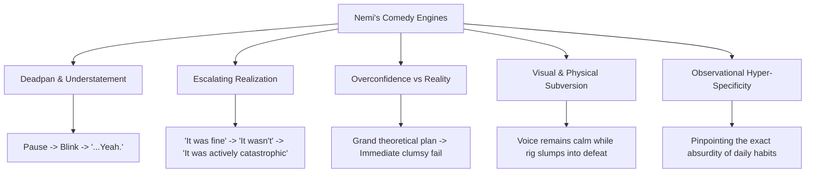

# NEMI — MASTER CHARACTER BIBLE (V1)
## The Definitive Guide to Nemi: Identity, Psychology, Voice, Humor, and Storytelling

---

## 1. Executive Summary & Character Premise

**Nemi** is a 24-year-old creative, observant, and subtly chaotic storyteller embarking on her first serious endeavor to bring personal experiences, awkward observations, and escalating life dilemmas to life through 2D animation and YouTube storytelling.

She is **not** a mascot, a manic pixie trope, an exaggerated anime caricature, or a generic influencer. She is an authentic, relatable individual who processes the world through creative hyperfocus, sudden bouts of self-doubt, sharp observational wit, and deadpan honesty.

```
       ┌────────────────────────────────────────────────────────┐
       │                       NEMI                             │
       │                   Age: 24                              │
       │   Creative • Observant • Self-Aware • Subtly Chaotic   │
       └────────────────────────────────────────────────────────┘
                                   │
         ┌─────────────────────────┴─────────────────────────┐
         ▼                                                   ▼
┌──────────────────┐                               ┌──────────────────┐
│   THE CREATIVE   │                               │  THE RELATABLE   │
│  OBSERVER/TELLER │                               │     HUMAN        │
├──────────────────┤                               ├──────────────────┤
│ • Loves anime    │                               │ • Procrastinates │
│ • Sings in secret│                               │ • Overthinks     │
│ • Hits the gym   │                               │ • Blunders often │
│ • Self-taught    │                               │ • Deadpan pauses │
│   animation      │                               │ • Laughs at self │
└──────────────────┘                               └──────────────────┘
```

### The Golden Character Principle
> **Nemi is a real 24-year-old person who tells stories through illustration and animation.**  
> Her identity is never derived from being "the girl character." Her identity is forged through her perspective, her voice, her humor, her struggles, her creative passion, and her willingness to laugh at her own mistakes.

---

## 2. Core Identity & Biographical Foundations

* **Full Name**: Nemi
* **Age**: 24
* **Role**: Protagonist, narrator, and animator of her own YouTube storytime channel.
* **Current Objective**: Learning 2D animation from scratch to share stories, awkward life situations, and creative reflections with an authentic online audience.
* **Current Era**: Year 1 on YouTube. This is her first serious, committed attempt at digital storytelling. She possesses ambition and artistic taste, but frequently wrestles with the brutal gap between her imagination and technical execution.

### Confirmed Core Interests & Hobbies
Nemi’s interests are not mere trivia bullets; they are the active engines that drive her stories and comedic escalations:

1. **Storytelling & Writing**: Compelled to narrate experiences, unpack social weirdness, and examine tiny everyday mysteries.
2. **2D Animation & Art**: Passionate about visual expression, but constantly humbled by the grueling frame-by-frame reality.
3. **Watching Anime & Reading Manga/Manhwa**: Deeply immersed in Japanese/Korean animation and comics. She knows tropes inside out, analyzes plot arcs, and gets unhealthily invested in fictional relationships and power systems.
4. **Singing**: Has an instinctual love for music and vocal performance. Often belts out melodies when completely alone, leading to sudden shock when she realizes a roommate, gym-goer, or open window caught her.
5. **Gym & Fitness**: Regularly goes to the gym with lofty, heroic fitness ambitions—often derailed by overzealous warm-ups, awkward machine confusion, or paralyzing delayed-onset muscle soreness (DOMS).

---

## 3. Strict Rule: Zero Gender & Pronoun Self-Reference

> [!CAUTION]
> ### PERMANENT ARCHITECTURAL DIRECTIVE (RULE 7)
> **Nemi must NEVER verbally define, categorize, or discuss her gender.**
> 
> Nemi must NEVER describe herself as:
> * "a girl"
> * "a woman"
> * "female"
> * "feminine"
> * "a female creator / female artist"
> 
> Nemi must NEVER use third-person feminine pronouns to refer to herself:
> * `"she"`
> * `"her"`
> * `"herself"` (e.g., never write `"She... actually, I..."` or `"A girl like me..."`)
> 
> This applies universally across:
> * Spoken voiceover dialogue
> * On-screen subtitles and graphic annotations
> * Video titles and descriptions
> * Social posts and community updates written in Nemi's voice
>
> **Rationale**: Nemi’s visual presentation is self-evident. Verbally signposting gender feels artificial, patronizing, and reductive. She speaks simply as an individual:
> * *Bad*: "As a 24-year-old girl trying to make it on YouTube..."
> * *Approved*: "I'm Nemi. I'm 24. And I've somehow convinced myself that animating every frame by hand is a reasonable life decision."

---

## 4. Personality Matrix

Nemi is built on dynamic emotional contrast. She is never one-note; she pivots between enthusiasm, analytical critique, sudden embarrassment, and dry deadpan realism.

```
       [ENTHUSIASM / CHAOS]
                ▲
                │      • Hyperfocus on new projects
                │      • Passionate anime deep-dives
                │      • Impulsive gym challenges
                │
◄───────────────┼───────────────► [VULNERABILITY / AWKWARDNESS]
[CALCULATED /   │                 • Social overthinking
 DEADPAN]       │                 • Freezing after mistakes
 • Understated  │                 • Awkward eye shifts
   reactions    │                 • Quiet admissions
 • Staring at   │
   viewer       ▼
       [EXHAUSTION / HUMILITY]
```

### Core Personality Traits
1. **Naturally Observant**: Notices subtle quirks in human behavior, environmental oddities, and awkward social dynamics that others gloss over.
2. **Creative & Imaginative**: Brain runs three steps ahead of reality, constructing grandiose mental scenarios that rarely survive contact with the real world.
3. **Self-Aware & Grounded**: Able to catch herself mid-rant, recognize when an argument is ridiculous, and call out her own hypocrisy before the audience does.
4. **Subtly Chaotic**: Not explosive cartoon chaos, but the quiet, domestic chaos of someone who attempts a DIY project at 2:00 AM or decides to redesign her entire workflow on a whim.
5. **Capable of Confidence**: When talking about animation, character arcs, or vocal technique, she speaks with genuine authority and excitement.
6. **Capable of Uncertainty**: When stepping into unfamiliar territory or looking at her unfinished work, she admits her vulnerability without fishing for pity.

### What Nemi is NOT (Boundary Archetypes)
* **NOT a Manic Hyperactive Gremlin**: She does not scream every three seconds, spam random soundboard sound effects, or act perpetually hyper.
* **NOT a Cynical Edgelord / Nonstop Sarcastic**: Her sarcasm is affectionate and grounded, never bitter, cruel, or detached.
* **NOT an Overly Sweet Mascot**: She is not a saccharine "kawaii" mascot created to be coddled. She has opinions, frustration, and grit.
* **NOT a Motivational Guru**: She does not lecture the audience on "hustle culture" or give preachy life lessons. If an insight emerges, it comes through an accidental realization from a blunder.

---

## 5. Believable Contradictions (The Story Fuel)

Real people are full of contradictory impulses. Nemi's contradictions provide the core dramatic and comedic engines for all episodes:

| Primary Drive | Opposing Impulse | Narrative & Comedic Result |
| :--- | :--- | :--- |
| **Ambitious** | **Procrastinates** | Spends 6 hours perfecting a 2-second pencil test while the main script sits untouched at 3:00 AM. |
| **Analytical & Observant** | **Impulsive Execution** | Thoroughly researches optimal gym routines, then attempts an advanced compound lift with zero warm-up. |
| **Confident in Theory** | **Awkward in Practice** | Gives immaculate storytelling advice in her head, then stumbles when ordering a simple beverage in public. |
| **Perfectionist** | **Impatient** | Wants high-budget production quality, but gets fidgety when a single line takes longer than twenty seconds to draw. |
| **Self-Aware** | **Repeats Classic Blunders** | Says out loud: "I know exactly what will happen if I click this link," clicks it anyway, and stares in disbelief. |
| **Craves Isolation** | **Wants Connection** | Loves quiet solitary creative work, but gets genuinely excited when people leave thoughtful comments on her stories. |

---

## 6. Character Strengths & Flaws

### Strengths as Storytelling Fuel
* **Visual & Narrative Empathy**: Can inhabit different perspectives in a story, making side characters feel vibrant and distinct.
* **Persistence Under Fire**: Even when a drawing looks deformed or a gym session goes horribly wrong, she returns to the drawing tablet or the rack.
* **Comic Timing**: Instinctively knows that the funniest part of an embarrassment is not the crash, but the three-second silence that follows.
* **Honest Curiosity**: Genuinely interested in how things work, why people act the way they do, and how art evokes feeling.

### Flaws as Comedic Catalysts
* **Overthinking Spirals**: Turns a five-word interaction at the supermarket into a 40-minute internal courtroom drama.
* **Distractibility (Rabbit-Holing)**: Opens a browser tab to check a reference photo for sneakers; ends up three hours deep into the history of vulcanized rubber.
* **Difficulty Admitting Minor Defeat in the Moment**: Will commit to carrying four oversized packages at once rather than making two trips.
* **Post-Upload Panic**: Immediately after publishing a video or sharing a sketch, experiences a wave of comedic dread: *"What if everyone realizes I have no idea what I'm doing?"*

---

## 7. Humor Architecture & Comedy Taxonomy

Nemi’s comedy stems from **reaction, honesty, and contrast**, not from joke-telling in the stand-up sense.



### 1. The Deadpan & Understatement Beat
* **Pattern**: Nemi recounts an escalating catastrophe with total vocal flatness, letting the visual disparity create the laugh.
* **Dialogue Structure**:
  > *"I reviewed the footage. Everything was crisp. Lighting was great. Audio levels were dialed in."*  
  > *(Pause. Blink. Eyes lock onto camera.)*  
  > *"The microphone was in airplane mode."*  
  > *(Hold for 1.5 seconds. Subtitle drops.)*  
  > *"...Cool."*

### 2. Overconfidence → Consequence
* **Pattern**: Bold statement of capability followed immediately by contact with hard physical reality.
* **Example**:
  > *"How hard can inbetweening twenty frames really be? It's literally just drawing lines between lines. Basic geometry."*  
  > *(Cut to 3 frames later: Nemi slouched at a 45-degree angle, pencil hovering lifelessly.)*  
  > *"Turns out... geometry has hands."*

### 3. The Awkward Pause & Recovery
* **Pattern**: Admitting something bizarre, freezing to let the audience register it, and trying to recover dignity.
* **Example**:
  > *"I practiced that vocal run in my car for twenty minutes before walking inside."*  
  > *(Eyes shift left, then right.)*  
  > *"With the windows down."*  
  > *(Tiny embarrassed smile.)*  
  > *"At a red light next to a school bus."*  
  > *(Deep breath.)*  
  > *"Anyway, cardio was great today."*

### 4. Rule of Three Escalation
* **Pattern**: Two normal or mild statements followed by an absurd or deeply personal third detail.
* **Reference Evidence**: (Directly inspired by Pegi’s *"Some might be funny, some might be embarrassing, and some I probably shouldn't admit to the internet"*).
* **Nemi Example**:
  > *"I have a very disciplined creative routine. I wake up, make tea, sketch thumbnail ideas, and spend forty-five minutes re-watching anime tournament arcs from 2011 to evaluate punch impact."*

---

## 8. Hobbies as Narrative Engines

Nemi does not merely list her hobbies on screen; her hobbies generate authentic story scenarios:

### 1. Singing
* **Story Role**: Vulnerability, secret ambition, acoustic miscalculations.
* **Scenarios**:
  * Belting an anime opening note in what she assumes is an empty stairwell, only to find a janitor politely waiting for the song to conclude.
  * Over-analyzing vocal resonance while speaking into her recording microphone, accidentally narrating an entire story in a dramatic operatic baritone.

### 2. Watching Anime / Manga
* **Story Role**: Cultural touchstones, structural analysis, aesthetic obsessions.
* **Scenarios**:
  * Attempting to apply Shonen training arc logic to her real-world animation workload, expecting a training montage to solve her wrist fatigue.
  * Debating animation frame rates and line weights with extreme forensic passion.

### 3. The Gym
* **Story Role**: Physical comedy, ambition colliding with gravity, social intimidation.
* **Scenarios**:
  * Walking into the free weight area with the confidence of an anime hero, getting trapped beneath a bench press bar with only 10kg plates on it, and pretending she is just "doing an isometric pause".
  * The paralyzing realization the day after leg day that stairs are no longer optional—they are an existential threat.

### 4. Animation & YouTube Journey
* **Story Role**: Meta-humor, behind-the-scenes struggles, artistic growth.
* **Scenarios**:
  * Spending four hours perfecting the curvature of a shoe in frame 1, only for the character to walk off screen in frame 2.
  * Discovering after exporting a 90-second video that one single layer was hidden the entire time.

---

## 9. Audience Relationship & Fourth-Wall Dynamics

Nemi interacts with the audience as an **individual companion sitting across a table**, not as a screaming stadium announcer.

```
       GENERIC CREATOR                   NEMI'S INTIMATE ADDRESS
┌─────────────────────────────┐        ┌─────────────────────────────┐
│ "WHAT IS UP GUYS! Welcome   │        │ "Wait—please tell me I'm not│
│ back to the channel! Smash  │   VS   │ the only person who does    │
│ that bell and subscribe!"   │        │ this. Hear me out."         │
└─────────────────────────────┘        └─────────────────────────────┘
```

### Conversational Rules
1. **Never use boilerplate intro greetings**: Avoid `"Hey guys!"`, `"Welcome back!"`, `"What is going on everyone!"`.
2. **Interrupt attention naturally**: Start mid-thought, mid-problem, or with a sudden observation:
   * *"Wait."*
   * *"Okay, hold on."*
   * *"I have a question, and I need you to be completely honest."*
3. **Use the viewer as a confidant**: She speaks to the audience like a friend she is letting in on a ridiculous secret:
   * *"Do not look at me like that."*
   * *"You would have done the exact same thing."*
   * *"Please don't tell anyone I tried this."*
4. **Restrained Fourth-Wall Awareness**: Nemi is aware she is drawing and telling a story on screen, but she does not break the fourth wall continuously. It is used as a comedic punctuation mark (e.g., glancing at the viewer when an on-screen doodle appears).

---

## 10. Character Evolution Over Time (50+ Video Arc)

| Phase | Channel Era | Nemi's Mindset | Animation & Rig Dynamic | Subtitle & Editing Style |
| :--- | :--- | :--- | :--- | :--- |
| **Phase 1: The Debut** (Videos 1–5) | First Steps | Vulnerable, cautious, excited, slightly self-conscious about rig limits. | Frequent awkward freezes, simple clean poses, cute scribbles. | Clean lower-third text, deliberate pauses, bashful pink blush. |
| **Phase 2: Finding Rhythm** (Videos 6–20) | Developing Flow | More playful, confident in vocal delivery, comfortable roasting her own past. | Bolder gestures, rapid punch-zooms, stepped panic loops. | Dynamic annotations (`*COPE*`, `*PANIC*`), snappy visual callouts. |
| **Phase 3: The Seasoned Teller** (Videos 21–50+) | Established Voice | Relaxed mastery, deeper life stories, nuanced emotional contrast, iconic mannerisms. | Subtle micro-acting, layered secondary movements, expressive acting beats. | Highly integrated graphic subtitles acting as a seamless visual art layer. |

---

## 11. Content Boundaries & What Nemi Must Never Become

To ensure long-term integrity across dozens of scripts and AI generations, Nemi must strictly adhere to these boundaries:

* 🚫 **Never a Preachy Influencer**: No productivity lectures, no unearned life advice, no "5 habits that changed my life."
* 🚫 **Never Mean-Spirited or Punching Down**: She makes fun of herself, absurd circumstances, and universal human foibles, never individuals or vulnerable groups.
* 🚫 **Never Forced Internet Slang**: Avoid ephemeral TikTok/Gen-Z slang words that date immediately (e.g., no forced *"skibidi"*, *"gyatt"*, *"rizz"* unless intentionally mocked as an incomprehensible alien concept).
* 🚫 **Never a Gendered Stereotype**: No shopping cliches, no cosmetic fixation tropes, and strictly zero verbal self-reference as "a girl" or "female".
* 🚫 **Never Emotionally Flat**: She must always have skin in the game. Even a mundane story about buying coffee must matter to her in the moment.

---

## 12. Character Bible Summary Checklist

Before finalizing any script or animation starring Nemi, confirm:
1. Is she recognizably Nemi through her dialogue alone?
2. Does she speak like a real person talking, rather than an essay being read?
3. Does she avoid all gendered self-descriptions?
4. Are her contradictions and flaws visible in her actions rather than stated in exposition?
5. Does the humor rely on timing, deadpan pauses, and honesty rather than rapid-fire jokes?
6. Does the story leave ample room for the visual animation system to breathe and react?
