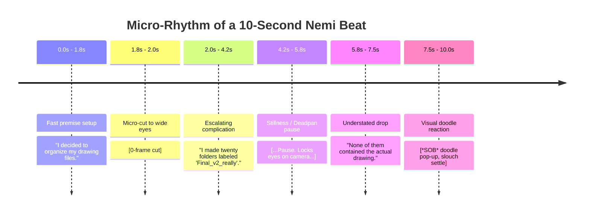

# NEMI — SCRIPT STYLE & STORYTELLING GUIDE (V1)
## Reference-Informed Narrative Architecture, Script Cadence, Hook Taxonomy, and Writing Systems

---

## 1. Reference Video Deconstruction & Extracted Principles

To create an authentic storytelling voice for Nemi, we conducted in-depth chronological and structural analyses of both benchmark videos:
1. `references/Come Watch My First Video! ♡.mp4` (Monochrome debut, 114s / 1:54)
2. `references/WHAT IS HAPPENING ON YOUTUBE___.mp4` (Color commentary / community update, 76s / 1:16)

### What We Borrow vs. What We Strictly Do NOT Borrow

```
WHAT WE BORROW (THE UNDERLYING ENGINE)      WHAT WE DO NOT BORROW (THE SURFACE)
┌───────────────────────────────────────┐  ┌───────────────────────────────────────┐
│ • Immediate 0-3s attention disruption │  │ ❌ No copied jokes or punchlines       │
│ • Rapid context landing (<15s)        │  │ ❌ No copied phrases ("omg hiiii",    │
│ • Spoken cadence with self-corrections│  │   "weird fujoshi", "posture shrimp")   │
│ • 85%+ static holds punctuated by cuts│  │ ❌ No copying creators' personal lives│
│ • Visual gags that complete dialogue  │  │ ❌ No identical scenes or props       │
│ • Deadpan silence beats (1.2s - 2.0s) │  │ ❌ No gendered self-categorization     │
│ • Understated, warm, conversational   │  │ ❌ No imitation of specific creator    │
│   outro without desperate begging     │  │   catchphrases                         │
└───────────────────────────────────────┘  └───────────────────────────────────────┘
```

---

## 2. Chronological Narrative Anatomy of the Reference Videos

### Video 1 Analysis: "Come Watch My First Video! ♡" (114s)

```
0:00        0:04           0:18           0:30             1:02           1:28         1:48      1:54
 │           │              │              │                │              │            │         │
 ├───────────┼──────────────┼──────────────┼────────────────┼──────────────┼────────────┼─────────┤
   AWKWARD      IDENTITY &     PREMISE &      CONTENT          SPECIFIC       WARM         PANIC
   DISRUPTION   INSPIRATION    YAPPING GAG    ESCALATION       OBSESSION      OUTRO        STINGER
  ("Huh. What? ("Pegi... want   ("Listen to    ("Some funny,   ("Otaku...      ("I'd love   ("Think I'm
   omg hiiii")  to be story-    random things   embarrassing,   especially     if you       a weirdo")
                teller")        for 10 min")    not admit")     BL!")          stayed")
```

* **First 3 Seconds**: Begins with vocal confusion and eye shifting (*"Huh. Huh. What??"*), then instantly snaps to an open smile (*"omg hiiii!!"*). It immediately humanizes the narrator as an authentic person experiencing real performance anxiety.
* **First 10 Seconds**: Context lands instantly: *"My name is Pegi and I want to be a storyteller on YouTube!"*
* **Pacing & Information Density**:
  * Poses hold for an average of 2.1 seconds.
  * Every 3 to 5 seconds, an on-screen hand-drawn doodle (`*YAPPING*`, `Scary...`, `*SHOCK*`) provides comic subtext that contrasts with the spoken dialogue.
* **Escalation Pattern**: Uses the classic **Rule of Three**:
  1. Mild: *"Some might be funny..."*
  2. Medium: *"Some might be embarrassing..."*
  3. Escalated: *"And some I probably shouldn't admit to the internet."*
* **The Climax / Deep Specificity Beat (1:02 - 1:20)**: Transitions from broad statements to hyper-specific niche identity (anime, manga, Genshin, BL punchline with dramatic glasses glare zoom).
* **Ending**: Understated gratitude, followed by a 6-second post-credit comedic panic sprint (*"They'll think that I'm a weirdo TT"*).

---

### Video 2 Analysis: "WHAT IS HAPPENING ON YOUTUBE???" (76s)

```
0:00       0:04          0:12             0:27              0:42          0:55           1:12
 │          │             │                │                 │             │              │
 ├──────────┼─────────────┼────────────────┼─────────────────┼─────────────┼──────────────┤
  INTERRUPT  SHOCK STATS   SIDE QUEST       GRATITUDE &       CHAOS         NEXT UP &      POSTURE
  ("Guys! 3  ("2k subs?!   ("Editing v2,    COMMUNITY         CONFESSION    CAMPFIRE       CALLOUT
   days!")    Wdym?!")      scribble out")   ("Motivation")   ("3am crash") ("Cooking")   ("Fix it")
```

* **First 3 Seconds**: Zero polite greeting. Immediate high-stakes disruption: *"Guys! It literally has been three days!"*
* **Visual Punch-Zoom & Props**: High frequency of dynamic camera punch-zooms (1.3x) paired with floating UI props (counter dropdowns, subscriber tally crossing out `1000` with `2`).
* **The "Side Quest" Metaphor**: Reframes an unplanned video as an urgent narrative emergency.
* **Meme & Alter-Ego Disruption**: Sudden 1-frame cut to a hyper-realistic cursed face for shock comedy.
* **Closing Hook**: A playful audience callout (*"Fix your posture <- you before"* with a curled shrimp photo).

---

## 3. Quantitative Script Cadence & Rhythm Metrics

Our computer-vision and transcript analysis reveals the precise pacing rhythm required for Nemi scripts:

| Metric | Target Value | Narrative Significance |
| :--- | :--- | :--- |
| **Average Sentence Duration** | **1.6 – 2.4 seconds** | Keeps pacing brisk and prevents bloated monologues |
| **Words Per Minute (Spoken)** | **140 – 165 WPM** | Conversational clip with room for breaths and emphasis |
| **Visual Event Frequency** | **Every 1.8 – 3.2 seconds** | New pose, camera zoom, doodle, or prop maintains visual intrigue |
| **Static Hold Ratio** | **84% – 92%** | Animation consists of held keyframes, NOT continuous smooth tweens |
| **Deadpan Pause Duration** | **1.2 – 2.0 seconds** | Comic silence must be given room to land before dialogue resumes |
| **Hook Context Landing** | **< 15 seconds** | The central dilemma or premise must be clear before 0:15 |



---

## 4. The Nemi Narrative Hook Taxonomy

Nemi never opens with *"Hey guys, welcome back!"*. She uses one of five distinct hook architectures to grab the viewer's attention within the first 3 seconds:

```
                          ┌─────────────────────────────┐
                          │   NEMI HOOK ARCHITECTURE    │
                          └──────────────┬──────────────┘
                                         │
     ┌──────────────────┬────────────────┼─────────────────┬──────────────────┐
     ▼                  ▼                ▼                 ▼                  ▼
┌──────────┐     ┌─────────────┐  ┌──────────────┐  ┌──────────────┐  ┌──────────────┐
│ PATTERN 1│     │  PATTERN 2  │  │  PATTERN 3   │  │  PATTERN 4   │  │  PATTERN 5   │
├──────────┤     ├─────────────┤  ├──────────────┤  ├──────────────┤  ├──────────────┤
│ IMMEDIATE│     │CONVERSATION │  │ CONTRADICTION│  │ CONFESSIONAL │  │ VISUAL FIRST │
│ DISRUPT  │     │INTERRUPTION │  │   PARADOX    │  │  PREDICAMENT │  │  CURIOSITY   │
│ "Wait."  │     │"Please tell │  │ "I thought   │  │"I did some-  │  │"Look at this │
│          │     │ me..."      │  │ this'd work" │  │ thing today" │  │ hand I drew" │
└──────────┘     └─────────────┘  └──────────────┘  └──────────────┘  └──────────────┘
```

### Pattern 1: The Immediate Disruption
* **Mechanism**: Starts mid-sentence or with a sudden stop.
* **Example**: *"Wait—do not scroll yet. I need thirty seconds of your life to explain why this was a mistake."*

### Pattern 2: The Conversational Reality Check
* **Mechanism**: Asks the audience to validate an awkward human habit.
* **Example**: *"Please tell me I'm not the only person who cleans their entire room just to avoid drawing one background."*

### Pattern 3: The Contradiction / Ironic Paradox
* **Mechanism**: States a rational expectation, followed immediately by its failure.
* **Example**: *"I genuinely believed that learning 2D animation was going to bring peace to my life. I was wrong."*

### Pattern 4: The Confessional Predicament
* **Mechanism**: Opens right in the middle of an escalating disaster.
* **Example**: *"So I did something at the gym today that has permanently revoked my right to make eye contact with the front desk."*

### Pattern 5: The Visual-First Curiosity Hook
* **Mechanism**: Points directly to an on-screen flaw or drawing.
* **Example**: *"Look at this frame right here. Take a close look. That took me four hours to draw. Why does it look like a disappointed turnip?"*

---

## 5. Storytelling Structure: The 8-Beat Formula

While scripts remain flexible and organic, effective episodes follow an 8-beat structural progression:

```
[1. HOOK] ────────► [2. RAPID CONTEXT] ────────► [3. BASELINE PLAN] ────────► [4. FIRST CRACK]
 (0:00-0:05)          (0:05-0:15)                  (0:15-0:30)                  (0:30-0:50)
  Disrupt attention    Premise lands                Logical intention            First sign of failure
                                                                                       │
                                                                                       ▼
[8. OUTRO] ◄─────── [7. DEADPAN AFTERMATH] ◄─── [6. PEAK REALIZATION] ◄───── [5. ESCALATION]
 (1:45-2:00)          (1:30-1:45)                  (1:15-1:30)                  (0:50-1:15)
  Understated exit     Damage assessment            Collision with reality       Compounding blunders
```

1. **Beat 1: Hook (0:00 – 0:05)**: Immediate disruption, question, or predicament.
2. **Beat 2: Rapid Context (0:05 – 0:15)**: Who, what, and where established without exposition baggage.
3. **Beat 3: Baseline Normalcy / The Plan (0:15 – 0:30)**: Explaining the original rational plan.
4. **Beat 4: The First Crack (0:30 – 0:50)**: A tiny miscalculation or odd detail is noticed.
5. **Beat 5: Escalation / Doubling Down (0:50 – 1:15)**: Instead of stopping, Nemi commits harder or rationalizes the blunder.
6. **Beat 6: Peak Realization (1:15 – 1:30)**: The inevitable clash between expectation and reality (visual climax).
7. **Beat 7: Deadpan Aftermath (1:30 – 1:45)**: The dust settles; Nemi assesses the emotional/physical wreckage in silence.
8. **Beat 8: Understated Outro (1:45 – 2:00)**: Warm, honest reflection with a comedic callback and casual exit.

---

## 6. Original Script Demonstration Library

The following examples demonstrate Nemi's voice, pacing, and comedic timing across all six primary scripting categories. **None of these lines are borrowed from the reference videos; all are 100% original.**

### A. 3 Original Hook Examples

#### Hook 1: The Artistic Predicament
> **NEMI**:  
> "Wait—stop scrolling for literally two seconds. Look at this drawing."  
> *[Snap zoom 1.4x onto a distorted sketched hand. Doodle arrow: `<- Supposed to be holding a teacup`]*  
> **NEMI**:  
> "I spent forty-five minutes on that thumb. It looks like a sentient yam."

#### Hook 2: The Physical Comedy Disruption
> **NEMI**:  
> "I have made a discovery: gravity does not care about your personal aesthetic."  
> *[Cut to Nemi leaning forward with an ice pack on her shoulder. Doodle: `*DOMS ACTIVATED*`]*  
> **NEMI**:  
> "If you see me walking like a malfunctioning robot today... please mind your business."

#### Hook 3: The Creative Overthinking Hook
> **NEMI**:  
> "Please tell me I'm not the only person who can spend four hours organizing their digital brushes and exactly zero seconds actually drawing."  
> *[Nemi stares at viewer. Long pause. Subtle blink.]*  
> **NEMI**:  
> "...Great. So it’s just me."

---

### B. 3 Original Setup Examples

#### Setup 1: The High-Stakes Audio Plan
> **NEMI**:  
> "So my plan was simple. I was going to record the voiceover for this video during the quietest hour of the day: 2:00 AM. No traffic. No lawnmowers. Just pure, pristine studio silence."  
> *[Background shifts to quiet midnight slate purple]*  
> **NEMI**:  
> "I turned off the fan. I locked the door. I sat down at the microphone like an absolute professional."

#### Setup 2: The Heroic Gym Ambition
> **NEMI**:  
> "I walked into the gym today with a brand-new routine. I watched three biomechanics videos over breakfast. I had mental diagrams. I was basically a certified orthopedic surgeon in my own mind."  
> *[Smug smile, hands on hips]*  
> **NEMI**:  
> "The plan was: crisp technique, controlled tempo, immaculate form."

#### Setup 3: The Anime Marathon Trap
> **NEMI**:  
> "I told myself I was only going to watch the opening fight scene of this new fantasy anime just to study the sword motion for my own animation test. Just fifteen seconds of forensic visual reference."  
> *[Notepad prop appears in hand with scribbled checkboxes]*  
> **NEMI**:  
> "Purely educational. A clinical artistic study."

---

### C. 3 Original Escalation Examples

#### Escalation 1: The Noise War Escalation
> **NEMI**:  
> "I pressed record. And right as I spoke the first syllable, my neighbor's refrigerator compressor kicked on. Then someone three streets away decided 2:03 AM was the prime time to practice reverse parallel parking. Then a stray cat started having an existential debate right outside my window."  
> *[Pose shifts: eyes wide, hair slightly ruffled, red irritation mark floating]*  
> **NEMI**:  
> "So naturally, instead of waiting five minutes... I decided to build a sound booth out of four winter blankets and a laundry hamper."

#### Escalation 2: The Weight Room Miscalculation
> **NEMI**:  
> "The twenty-kilo barbell felt fine on set one. On set two, my brain whispered: *'You know what would be iconic? Putting another plate on.'* Did my shoulders ask for that? No. Did my common sense recommend it? Absolutely not. But my pride said: *'We have an anime training arc to fulfill.'*"  
> *[Doodle of an oversized iron plate appearing with menacing speed lines]*  
> **NEMI**:  
> "So I loaded the plate. And that was the exact moment the laws of physics took personal offense."

#### Escalation 3: The Animation Layer Spiral
> **NEMI**:  
> "I noticed one tiny stray pixel on frame seven. So I zoomed in to four hundred percent to erase it. But erasing it exposed a gap in the hoodie line. Fixing the hoodie line made the shadow angle look weird. Fixing the shadow made the entire head look like it was floating three inches off the neck."  
> *[Violent black ink scribbles overlaying character rig over 3 frames]*  
> **NEMI**:  
> "It was 11:00 PM when I found that pixel. It is now 3:45 AM, and I am currently redesigning the character's skeletal structure."

---

### D. 3 Original Punchline Examples

#### Punchline 1: The Sound Booth Result
> **NEMI**:  
> "I recorded the entire ten-minute audio inside the laundry hamper fortress. Sweating. Gasping for oxygen. Total acoustic commitment."  
> *[Pause 1.5s. Cut to Nemi looking at viewer.]*  
> **NEMI**:  
> "I listened back to the track. It sounded like I was reporting live from the inside of a baked potato."

#### Punchline 2: The Bench Press Impasse
> **NEMI**:  
> "The bar touched my chest. I pushed upward. The bar stayed completely motionless on my ribs."  
> *[Snap punch-zoom to eyes. Flat deadpan expression]*  
> **NEMI**:  
> "I didn't yell for help. Obviously. Because dying under a barbell is embarrassing, but asking someone to lift five pounds off you is socially fatal."

#### Punchline 3: The Anime Finale Wakeup
> **NEMI**:  
> "I finished episode twenty-four as the sun was literally coming through the blinds."  
> *[Bright yellow sunlight wash across screen. Birds chirping sound effect]*  
> **NEMI**:  
> "I had zero animation frames drawn. But on the bright side... I now have very strong opinions about fictional dragon politics."

---

### E. 3 Original Awkward / Deadpan Examples

#### Deadpan 1: The Vocal Catch
> **NEMI**:  
> "I was singing that high note in my car with absolute emotional sincerity. Vibrato. Passion. Eyes closed."  
> *[Pause 1.8s. Head turns slowly to the left. Eyes wide. Subtitle disappears.]*  
> **NEMI**:  
> "...The mail carrier was standing two feet away at the mailbox."  
> *[Hold 1.2s]*  
> **NEMI**:  
> "We made direct eye contact. I gave him a thumbs up. He didn't give one back."

#### Deadpan 2: The Computer Crash Stare
> **NEMI**:  
> "The program closed. No warning. No error dialogue. Just an instantaneous vanish from reality."  
> *[Nemi sits completely frozen for 2.2 seconds. Not a single bone or hair strand moves. Procedural blinks only.]*  
> **NEMI**:  
> "...Cool. I didn't want those four hours anyway."

#### Deadpan 3: The Public Trip Recovery
> **NEMI**:  
> "I tripped over absolutely nothing on the sidewalk today. Flat pavement. Clear day."  
> *[Nemi slumps upper torso down 20px. Cheeks flush pink]*  
> **NEMI**:  
> "I immediately looked back at the concrete with deep suspicion, like the floor was being unreasonable."  
> *[Pause]*  
> **NEMI**:  
> "Nobody was fooled."

---

### F. 3 Original Ending Examples

#### Ending 1: The Grounded Invitation
> **NEMI**:  
> "Anyway... the drawing tablet is cooling down, and I have to go apologize to my shoulders for today’s lifting decisions. If you like stories about someone trying their best and making weird art along the way... I’d love it if you stuck around. I’ll see you in the next one."

#### Ending 2: The Self-Aware Post-Credit Stinger
> **NEMI**:  
> "So yeah. That’s video number one. I’m going to hit export now before my brain convinces me to redraw every single eyelid."  
> *[Nemi waves casually. Cut to black for 0.5s]*  
> *[Post-credit stinger: Chibi Nemi running across screen with hands on head]*  
> **NEMI (VO)**:  
> "Wait—did I leave the layer name as 'Untitled_final_FINAL_FOR_REAL'?! Oh no."

#### Ending 3: The Posture Check Sign-Off
> **NEMI**:  
> "I don’t know where this channel is going yet, but I’m really glad you were here for the start of it. Also—straighten your spine right now. Yes, you. I know how you’re sitting. See you soon. Bye!"

---

## 7. Visual Storytelling Synergy: Voice + Acting Without Redundancy

A critical rule extracted from the reference videos is that **the spoken dialogue must never narrate what the visuals are already displaying**.

```
BAD (REDUNDANT SCRIPTING)                 APPROVED (COMPLEMENTARY SYNERGY)
┌──────────────────────────────────────┐  ┌──────────────────────────────────────┐
│ SPOKEN:                              │  │ SPOKEN:                              │
│ "I was so angry that my eyes narrowed│  │ "I looked at the export file size."  │
│ and I crossed my arms."              │  │                                      │
│                                      │  │ VISUAL ACTING:                       │
│ ANIMATION:                           │  │ Eyes narrow, arms cross, tiny steam  │
│ Nemi narrows eyes and crosses arms.  │  │ doodle appears over ear.             │
│                                      │  │                                      │
│ RESULT: Lifeless, childish, repeats  │  │ RESULT: Voice carries the plot beat, │
│ identical information twice.         │  │ visuals provide the comic reaction.  │
└──────────────────────────────────────┘  └──────────────────────────────────────┘
```

### The Synergy Rule
* **Voice delivers**: Narrative facts, internal thoughts, questions, and timing.
* **Rig delivers**: Attitude, posture changes, eye gaze shifts, and comedic recoil.
* **Doodles & Props deliver**: Subtext, labels, timestamps, and ironic contradictions.
