# REFERENCE VIDEOS COMPREHENSIVE ANALYSIS
## Deconstructing YouTube Illustrated Storytelling for the Godot 2D Animation Framework

**Source References Analyzed**:
1. `references/Come Watch My First Video! ♡.mp4` (Pegi, 114.3s, 1280×720 @ 30fps)
2. `references/WHAT IS HAPPENING ON YOUTUBE___.mp4` (Pegi, 75.8s, 1920×1080 @ 30fps)

---

## 1. Executive Summary & Core Realization

The reference videos are authentic examples of the **YouTube Illustrated Storytime / Animatics** genre (in the tradition of Emirichu, LilyPichu, Jaiden Animations, and TheOdd1sOut). 

### What We Are Trying to Achieve
We are **not** building a conventional 2D cartoon puppet that continuously moves with smooth 60fps rubber-hose tweens. In this storytelling genre:
* **Motion is expressive punctuation, not constant displacement.**
* **84% to 94% of the duration consists of static HOLDS** on high-personality, strong silhouette poses.
* Transitions between key beats are **hard 0-frame cuts** or **punch zooms**, synchronized strictly to the speaker's vocal inflections and comedic timing.
* When continuous motion is employed, it is rendered as **2- to 4-frame stepped cycles** (held on 2s or 3s, effective 8–12 fps) for comedic panic, flailing, or trembling.
* Visual interest is generated through **rapid comedic devices**: hand-drawn annotations, speech bubbles, pop-up props, background mood color swaps, chibi alter-egos, scribble rage scratch-outs, and sudden meme face inserts.

---

## 2. Quantitative Motion & Editing Metrics

By running frame-difference computer vision analysis across both reference videos, we measured the actual motion distribution:

| Metric | Video 1: "First Video" (Monochrome) | Video 2: "What Is Happening" (Color) | Architectural Takeaway |
| :--- | :--- | :--- | :--- |
| **Duration** | 114.35 seconds (1:54) | 75.83 seconds (1:16) | Fast-paced short-form commentary |
| **Resolution** | 1280 × 720 (16:9) | 1920 × 1080 (16:9) | Standard 16:9 widescreen canvas |
| **Total Scene Cuts** | 80 detected cuts | 32 detected cuts | High cut frequency (avg cut every 1.4s to 2.3s) |
| **Holds (<0.5 frame diff)** | **83.8%** | **94.4%** | **Overwhelmingly pose-to-pose holds** |
| **Micro-Motion / Drift (0.5–5.0)**| 3.7% | 2.9% | Subtle breathing/settle, eye blinks only |
| **Major Pose Cuts / Anim (>5.0)** | 12.6% | 2.7% | Instant pose swaps & stepped loops |

> [!IMPORTANT]
> **Why Generic "AI Animation" / Smooth Puppet Tweening Fails Here**:
> If an AI system continuously tweens character limbs with smooth easing, the result looks like a lifeless corporate explainer video or cheap puppet show. The magic of this genre comes from **sharp, intentional pose changes, visual punchlines, and hand-drawn micro-events that freeze on the beat**.

---

## 3. Reference Video 1: "Come Watch My First Video! ♡"


*Figure 1: Contact sheet of key scenes from "Come Watch My First Video! ♡"*


*Figure 2: Complete 2-second narrative timeline across all 114 seconds of Video 1.*

### Visual Identity & Palette
* **Monochrome Ink Aesthetic**:
  * Line art: Warm deep burgundy/plum ink (`#501B30` / `#3E081E`). It is never harsh digital black (`#000000`).
  * Canvas/Background: Warm creamy paper off-white (`#FAF7F5` / `#FFFFFF`).
  * Accent Tint: Soft warm pink hatching blush on cheeks and bashful moments (`#FF9AA2` / `#E8A2A8`).
  * Spot Color: Used sparingly for high-context props (small national flags, comic book covers).

### Key Scene Highlights & Storytelling Devices
````carousel

<!-- slide -->

<!-- slide -->

<!-- slide -->

````

1. **The Shy Greeting (00:00 - 00:04)**:
   * Starts with eyes darting around: "Huh.", blinks, then cuts instantly to open smiling arms: "omg hiiii!!".
2. **The "Yapping" Contrast Gag (00:22 - 00:28)**:
   * "Or just enjoy watching someone talk about completely random things" -> **Arms thrown wide with `*YAPPING*` floating above head**, followed immediately by an introverted slouch with hands clasped: `for ten minutes, Scary...`.
3. **The Dramatic Punch-Zoom & Glasses Glint (01:16)**:
   * "I love manga, manhwa, anime, donghua..." -> **Instant 1.4x snap zoom to the eyes**: "especially BL." featuring reflective white glasses anime glare, smug grin, and dense line hatching. Cut back out to shy blush: `Embarrassed...`.
4. **The Post-Credit Stepped Panic Run (01:48 - 01:54)**:
   * "They'll think that I'm a weirdo TT": A 3-frame looping cycle of frantic flailing legs and arms held on 3s, expressing comedic post-upload regret as the character dashes out of frame.

---

## 4. Reference Video 2: "WHAT IS HAPPENING ON YOUTUBE???"


*Figure 3: Contact sheet of key scenes from "WHAT IS HAPPENING ON YOUTUBE???"*


*Figure 4: Complete 2-second narrative timeline across all 76 seconds of Video 2.*

### Visual Identity & Palette
* **Full Color Cel Aesthetic**:
  * Line art: Deep warm chocolate/burgundy (`#57282D` / `#3E081E`).
  * Hair: Rich auburn/burgundy brown (`#65353D`) with bold, blocky highlight ribbons.
  * Eyes: Deep crimson/ruby with white sparkle highlights.
  * Skin: Fair peach skin with soft coral airbrushed blush and angled hatch lines.
  * Outfit: Sleek black sleeveless halter-neck top.
* **Mood-Driven Background Swaps**:
  * **Neutral Talking**: Soft pale ice-blue / clean wash (`#E4F5FF` / `#EBF3F8`).
  * **Intense Crisis / Panic**: Full saturated solid maroon/crimson (`#753239`).
  * **Late-Night Crashout**: Desaturated moody slate purple (`#716986`).

### Key Scene Highlights & Storytelling Devices
````carousel

<!-- slide -->

<!-- slide -->

<!-- slide -->

````

1. **The Shock & UI Counter (00:04)**:
   * Wide trembling eyes, open mouth, squiggly `SHOCK` text and a floating paper rectangle with `1000 Follower` crossed out with a red `2`.
2. **The "Side Quest" Violent Scribble Out (00:16)**:
   * "I decided to do this side quest": Background snaps instantly to dark maroon (`#753239`). Violent black digital ink scribbles violently strike through the character over 3 frames until only crude angry speed lines remain.
3. **The Cursed Realistic Wojak Face (00:20)**:
   * "so here I am!": Instant hard cut to an absurd, hyper-detailed Wojak/Gigachad face with chiseled lips and veiny shading, completely shattering the anime aesthetic for pure shock comedy.
4. **The UI Form Select Gag (00:30)**:
   * Mock OS form dropdown: `Gender: [ Female v ]`, displaying choices `Female`, `Male`, and `Fujoshi` highlighted in pink, paired with a sneaky smiling character rubbing hands together (`HEHEHE...`).
5. **The Sad Cat Meme & Campfire Cooking (00:46 - 01:00)**:
   * Crying white kitten meme juxtaposed with a cute red tomato chibi mascot (`im so shocked`).
   * "the second video is getting cooked rn!": Wide shot of the character stirring an iron pot over crackling campfire flames.
6. **The Posture Shrimp Outro (01:12)**:
   * Comedic call-out to viewers: A photo of a curled cooked shrimp labeled `fix your posture. <- you before`.

---

## 5. The 6 Architectural Pillars of the Storytelling Framework

From our analysis of both reference videos, the Godot 2D storytelling framework must be built on these 6 operational pillars:

```mermaid
graph TD
    A[Storytime Video Director] --> B[Pillar 1: Pose-to-Pose Hierarchy]
    A --> C[Pillar 2: Dual Art Modes]
    A --> D[Pillar 3: Dynamic Mood Backgrounds]
    A --> E[Pillar 4: Comic Text & Floating Doodles]
    A --> F[Pillar 5: Comedic Alter-Egos & Meme Disrupters]
    A --> G[Pillar 6: Audio-Synced Camera Choreography]

    B --> B1[Holds 85%]
    B --> B2[0-Frame Hard Cuts]
    B --> B3[Stepped Cycles 8-12fps]
    B --> B4[Procedural Micro-Blinks]

    C --> C1[COLOR Cel Mode]
    C --> C2[MONOCHROME Ink Mode]

    D --> D1[Neutral Wash]
    D --> D2[Crimson Panic]
    D --> D3[Slate Purple Despair]

    E --> E1[Handwritten Annotations]
    E --> E2[Speech Bubbles & UI Popups]

    F --> F1[Gremlin / Chibi Variant]
    F --> F2[Scribble Scratch-out]
    F --> F3[Meme / Wojak Inserts]

    G --> G1[Snap Punch-Zoom 1.2x - 1.5x]
    G --> G2[Comedic Screen Shake]
```



### 1. Pose-to-Pose Stepped Hierarchy
* **Hold Rule**: Poses remain frozen on screen for 2.0s to 4.0s while dialogue plays.
* **Cut Rule**: Major pose changes happen in **0 frames** (instant cut on syllable or beat), never sliding into place with slow tweens.
* **Stepped Loop Rule**: High-energy emotions (panic, running, rage, stirring a pot) use a 2-frame to 4-frame stepped loop held on 3s or 4s.
* **Micro-Motion Rule**: Blinking (2-frame closed eyes) and subtle eye gaze shifts occur every 2–4 seconds to maintain life.

### 2. Dual Art Mode System
* The character geometry and rig must seamlessly support **two render modes on the exact same rig**:
  1. **COLOR Mode**: Full cel shading, palette highlights, colored eyes and garments.
  2. **MONOCHROME Mode**: Pure `#3E081E` line art, white/transparent fills, and pink cheek hatch blush.
* Switching modes must be an instantaneous flag (`set_art_mode(ArtMode.COLOR)` / `ArtMode.MONOCHROME`).

### 3. Dynamic Mood Backgrounds
* The canvas background is not a static backdrop; it is an active emotional amplifier:
  * **Neutral**: Off-white / pale wash for relaxed dialogue.
  * **Panic / Crisis / Focus**: Deep solid maroon / crimson (`#753239`).
  * **Existential Dread / Late Night**: Muted slate purple / dark navy (`#716986`).

### 4. Floating Doodles & Graphic Popups
* The engine must support spawning hand-drawn graphic annotations anchored to screen or character coordinates:
  * Comic labels (`*YAPPING*`, `SHOCK`, `RAHHH!!!`, `Embarrassed...`).
  * Arrows and labels (`<- Just woke up`, `<- My posture`, `<- Never animated before.`).
  * UI popups (Subscriber counters, check-list cards, form dropdowns).

### 5. Comedic Alter-Egos & Disrupters
* Storytellers do not stay in standard proportion all the time. The framework must support:
  * **Chibi / Gremlin mode**: Simplified squat proportions for toddler fits, crawling on the floor, or cheering.
  * **Violent Scribble overlay**: Rapid line scratch-out covering the character during frantic moments.
  * **Hyper-realistic meme inserts**: Sudden full-frame cut to external meme images for comedic punchlines.

### 6. Audio-Synced Camera Choreography
* **Snap Punch-Zoom**: 1-frame camera zoom (e.g. 1.0x -> 1.4x) focused directly on the character's face for confessions, whispers, or punchlines.
* **Screen Shake**: 3- to 6-frame decay impulse on loud vocal shouts, crashes, or angry tantrums.

---

## 6. How Nemi Implements These Requirements in Godot

Our reconstructed Nemi character (`characters/nemi/nemi.gd`) directly fulfills every aesthetic and technical requirement discovered in these reference videos:

1. **100% Native Vector Drawing**:
   * No cropped bitmaps or static sprites. Nemi's head, flowing hair, facial features, hoodie, skirt, limbs, and sneakers are constructed from dynamic `_draw()` polylines and colored polygons.
2. **Skeleton2D / Bone2D Rigged Body**:
   * Generates any pose dynamically (standing, pointing, thinking, excited, leaning, recoiling, novel custom poses) using bone angles rather than pre-rendered pictures.
3. **Procedural Facial System (`NemiFace.gd`)**:
   * Direct control over eye gaze vectors (`look_at_direction`), 2-frame organic blinks, eyebrow angles, mouth shapes (`:3`, open talk, gasp, smile, smirk), blush hatching, and anime sweat drops.
4. **Instant Dual-Style Switching (`NemiStyle.gd`)**:
   * Switching between `COLOR` (sage hoodie, emerald eyes, ginger hair) and `MONOCHROME` (`#3E081E` ink lines, white fills, pink blush) happens live on the exact same geometry.
5. **Director API for AI Automation**:
   * High-level commands like `set_pose("pointing")`, `set_expression("smug")`, `punch_zoom(1.4)`, `snap_background("maroon")` allow an AI agent to write clean storytelling scripts that faithfully recreate the timing and comedic pacing of these references.
